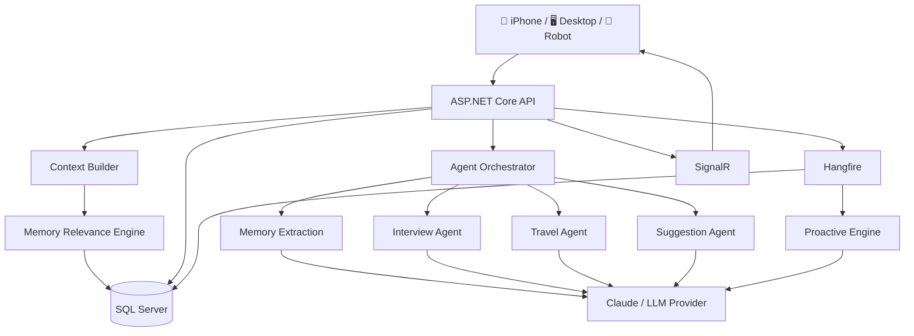

<div align="center">


<br/>

<a href="https://www.linkedin.com/in/barorel/">
  
</a>
<a href="https://github.com/BarOrel">
  
</a>

<br/><br/>

### ⚔️ Build beyond the obvious.

</div>

---

# 🧭 About Me

I'm **Bar**, a Software Engineer with **3+ years of experience** building production systems, with a strong focus on:

- **C# / .NET backend engineering**
- **Full-stack development with Angular**
- **AI-native software and agentic systems**
- **Realtime and distributed architectures**
- **System design, context, memory, and orchestration**

I like building systems that go beyond CRUD and static screens.

The kind of software I enjoy most is software that can:

**remember → reason → react → orchestrate → act**

---

# 🌌 Featured Project — Life OS

## 🧠 An Agentic Personal AI Operating System

**Life OS** is a personal engineering project built to explore how specialized AI agents, persistent memory, context engineering, background processing, and multiple clients can work together as one coherent system.

The project is not designed as a simple chatbot wrapper.

Its core question is:

> **How do you give an AI system useful long-term memory without dumping everything it knows into every prompt?**

The guiding principle is:

> **Information being relevant to the user does not automatically mean it is relevant to the current task.**

---

## ⚙️ How Life OS Works



---

## 🤖 Specialized Agent Architecture

Life OS uses **specialized agents** rather than relying on one general-purpose prompt.

The current orchestration flow includes:

### Memory Extraction Agent
Runs first and extracts structured facts from user input.

Examples of stored facts:

`profession`  
`employer`  
`has_dog`  
`location_city`  
`job_search_status`  
`wake_up_time`

Facts are stored as structured profile information instead of repeatedly rediscovering them from conversation history.

### Interview Agent
Triggered when an interview-related event is created.

It uses existing context and generates relevant preparation information.

### Travel Agent
Triggered around travel-related events.

It helps calculate departure timing and contextual reminders.

### Suggestion Agent
Runs after the specialized agents and produces broader recommendations based on the latest context.

### Proactive Manager / Proactive Engine
Runs independently from direct user input.

The system periodically checks for situations such as:

- upcoming events
- interview preparation
- relationship reminders
- deadlines
- habit activity
- personal rules
- other contextually relevant situations

The goal is for the system to occasionally **surface something useful before being explicitly asked**.

---

# 🧠 Memory & Context Engineering

This is one of the main engineering problems behind Life OS.

A user's information grows continuously:

- conversations
- events
- tasks
- habits
- goals
- relationships
- profile facts
- memories
- notifications

Sending all of it to the model every time would create noisy, expensive, and eventually unmanageable prompts.

Life OS separates information into different layers.

### 1. Persistent Information

Long-term information stored by the system:

- profile facts
- memories
- events
- tasks
- goals
- habits
- relationships

### 2. Current State

The immediate situation:

- current user input
- recently created entities
- conversation state
- current date/time
- today's tasks and events

### 3. Task-Relevant Context

The subset that actually matters to the current agent.

---

## 🎯 Memory Relevance Scoring

Instead of blindly selecting all stored memories, Life OS ranks them.

The relevance engine currently considers:

- **Importance**
- **Recency**
- **Previous usage**
- **Keyword / task relevance**

Older memories decay over time, while useful or repeatedly relevant memories can stay important.

Only the highest-ranked memories are injected into the agent context.

This is intentionally simpler than immediately adding vector search.

The trade-off is explicit:

**rule-based relevance is easier to reason about and control, while semantic retrieval can eventually improve matches where wording differs heavily.**

---

# 🧬 Context Builder

Before an agent runs, `ContextBuilderService` prepares a structured view of the user's current world.

It may include:

- today's events
- tomorrow's events
- upcoming calendar events
- overdue tasks
- tasks due today
- active goals
- active habits
- relationship follow-ups
- recent notifications
- profile facts
- ranked memories
- current trigger text
- newly created entities
- current local time

Agents therefore receive a **purpose-built context**, rather than an unbounded conversation dump.

---

# ⚡ Background & Proactive Processing

Life OS is not limited to request → response.

**Hangfire** is used for persisted background jobs.

Examples include:

- processing captured information asynchronously
- scheduled proactive analysis
- event-related checks
- delayed notifications
- periodic context checks

This allows the application to work even when the user is not actively interacting with it.

---

# 📡 Realtime Communication

Life OS uses **SignalR** for realtime updates between the backend and connected clients.

For example:

1. the user captures something
2. the UI immediately shows a processing state
3. a background job processes the request
4. the result is persisted
5. SignalR notifies the client
6. the UI refreshes with the completed result

This keeps long-running AI operations from blocking the user experience.

---

# 🔔 Notification System

The notification system is designed around the idea that notifications should be useful rather than noisy.

It supports:

- realtime notifications
- push notifications
- aggregation
- topic-based grouping
- quiet hours
- priority handling

Multiple related notifications can be merged rather than spamming the user.

---

# 🧩 Architecture

The backend is structured around **Clean Architecture principles and CQRS**.

### Domain
Entities, enums, value objects.

### Application
Commands, queries, interfaces, DTOs, business use cases.

### Infrastructure
EF Core, persistence, agents, AI provider implementations, notifications, background jobs.

### API
ASP.NET Core controllers, SignalR hubs, application startup.

The goal is to keep business logic separated from infrastructure and external services.

---

# 📱 Multi-Client System

Life OS is not only a backend project.

## 📲 Mobile — iOS

Built with:

**Angular + Ionic + Capacitor**

Includes interfaces for:

- inbox / captured information
- calendar
- tasks
- goals
- habits
- relationships
- notifications
- research results
- daily briefing

---

## 🖥 Desktop Agent

Windows desktop application for fast interaction with Life OS.

Features include:

- global hotkey capture
- text capture
- voice capture
- system tray integration
- lightweight floating UI

---

## 🤖 Robot Client

Android-based robot client built with Angular / Ionic / Capacitor.

Includes:

- on-device wake-word detection
- voice interaction
- animated face UI
- backend communication
- local robot command execution
- emergency-stop mechanisms

---

# 🔬 Research & AI Workflows

Life OS also includes structured AI-assisted workflows such as:

- research generation
- interview preparation
- contextual suggestions
- memory extraction
- proactive insights
- entity classification
- natural-language capture

AI interactions are exposed through provider abstractions so model-specific logic does not have to leak throughout the application.

---

# 🛠 Life OS Tech Stack

<div align="center">


</div>

| Area | Technology |
|---|---|
| Backend | C# / .NET 8 / ASP.NET Core |
| Architecture | Clean Architecture / CQRS / MediatR |
| Database | SQL Server / Entity Framework Core |
| AI | Anthropic Claude / AI provider abstraction |
| Background Jobs | Hangfire |
| Realtime | SignalR |
| Mobile | Angular / Ionic / Capacitor |
| Desktop | .NET / WinForms |
| Infrastructure | Docker / Docker Compose |
| Testing | xUnit / Moq |

---

# 🧪 Engineering Trade-offs I Care About

Life OS gave me a lot of interesting engineering decisions to work through.

### Context without blindly using vector search

I intentionally started with deterministic relevance scoring.

This makes the behavior easier to:

- understand
- debug
- tune
- explain

Semantic retrieval can be introduced later where it actually provides value.

---

### Sequential Agents vs Parallel Agents

Agents currently execute sequentially in relevant flows.

One important constraint is EF Core's `DbContext`, which is not designed for concurrent operations within the same unit of work.

I prefer **correct and debuggable execution** over parallelism just for the sake of parallelism.

---

### Async AI without a frozen UI

LLM work can take time.

Instead of forcing the client to wait:

- create placeholder state
- process asynchronously
- persist the result
- notify via SignalR
- refresh the client

---

### Deterministic logic where LLMs are unnecessary

Not every problem needs an AI model.

Calendar overlap detection, notification aggregation, scheduling rules, and other deterministic operations remain normal application logic.

I prefer using an LLM where ambiguity or reasoning adds value — not everywhere.

---

# 🤖 How I Build With AI Agents

AI coding agents are part of my normal development workflow.

I use them for:

- repository investigation
- feature implementation
- debugging
- refactoring
- test generation
- architecture exploration
- documentation

But the workflow is not:

`prompt → accept`

It is closer to:

```text
SPEC
  ↓
DECOMPOSE
  ↓
AGENT INSPECTION
  ↓
IMPLEMENTATION
  ↓
HUMAN REVIEW
  ↓
TEST
  ↓
REJECT / REFINE / SHIP
```

I treat AI agents as **fast engineering collaborators**, not trusted code generators.

The agent can produce the first implementation.

I still own:

- architecture
- correctness
- state transitions
- failure cases
- side effects
- maintainability
- what actually ships

👉 **Explore the repository:**  
### [github.com/BarOrel/LifeOS](https://github.com/BarOrel/LifeOS)

---

# 🛰 Other Projects

## 🏡 Homeiy

Full-stack real estate product I built around property discovery and AI-assisted search.

### Highlights

- natural-language property search
- structured query extraction
- map-based discovery
- geolocation filtering
- realtime property updates
- mobile-first architecture

### Stack

`.NET 8` `Angular` `Ionic` `SQL Server` `SignalR` `Docker`

---

## ⚙️ Workflow Engine API

Dynamic workflow engine for configurable business processes.

Highlights:

- conditional execution
- strategy-based architecture
- extensible operation pipelines
- configurable workflow execution
- .NET backend architecture

---

# ⚔️ Arsenal

<table>
<tr>
<td width="25%" valign="top">

### Backend

`C#`

`.NET`

`ASP.NET Core`

`REST APIs`

`EF Core`

`SQL Server`

`Redis`

`RabbitMQ`

`SignalR`

</td>

<td width="25%" valign="top">

### Frontend

`Angular`

`TypeScript`

`Ionic`

`Capacitor`

`React`

</td>

<td width="25%" valign="top">

### AI

`AI Agents`

`Orchestration`

`Context Engineering`

`Memory Systems`

`LLM Integration`

`RAG Concepts`

`Anthropic`

`OpenAI`

</td>

<td width="25%" valign="top">

### Systems

`Docker`

`Linux`

`CI/CD`

`CQRS`

`DDD`

`Clean Architecture`

`Distributed Systems`

`Kubernetes Fundamentals`

</td>
</tr>
</table>

---

# 🌠 Current Coordinates

```yaml
engineer: Bar Orel

main_stack:
  - C#
  - .NET
  - Angular
  - TypeScript

building:
  - AI-native systems
  - backend architectures
  - realtime applications
  - agentic workflows

exploring:
  - multi-agent systems
  - context engineering
  - persistent memory
  - semantic retrieval
  - distributed systems
  - AI-first development

philosophy:
  - use AI where reasoning adds value
  - keep deterministic logic deterministic
  - architecture still matters
  - fast is useful only when correct
```

---

# 📊 GitHub Signal

<div align="center">


<br/>


</div>

---

# 📡 Connect

<div align="center">

<a href="https://www.linkedin.com/in/barorel/">
  
</a>

<br/><br/>

### Keep moving forward.


</div>
